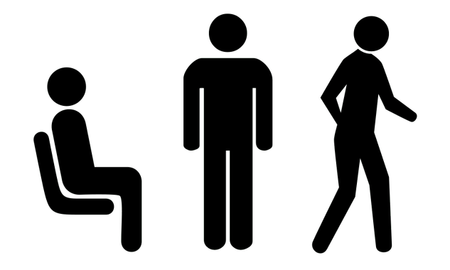

# Smartphone Activity Recognition
> Machine learning approach to classification of human activities and postural transitions based on smartphone accelerometer and gyroscope data. 

## Table of contents
* [General info](#general-info)
* [Screenshots](#screenshots)
* [Technologies](#technologies)
* [Setup](#setup)
* [Features](#features)
* [Status](#status)
* [Inspiration](#inspiration)
* [Contact](#contact)

## General info
The goal of this project is to classify the static postures and dynamic activities of people performing basic activities using smartphone accelerometer and gyroscope data.  The static postures include standing, sitting and lying while the dynamic activities include walking, walking upstairs and walking downstairs.  There are also postural transitions between the static postures

## Screenshots

## Technologies
* Python 3.9.0 as development language
* Sci-Kit Learn 0.23.2 for modeling
* Models - To be determined

## Setup
Setup environment by importing pandas, numpy and the sci-kit learn models mentioned in the Technologies section

## Code Examples
See project2-partX notebooks

## Features
Dataset consists of 10,929 rows by 561 columns.  
* More details to come...

  
Features that most affect postural prediction
* More details to come...

To-do list:
* scale data
* determine best classification algorithm
* tune model hyperparameters
* make presentation of data, modeling and prediction accuracy

## Status
Project is: _in progress_

## Inspiration
As always, the good people in my coding community who provide guidance and wisdom as I take on more projects to develop my skillset.  Also, I want to see how easy it is to make a prediction of posture based on data from cell phones. 

## Contact
Created by Kenny Bundy - feel free to contact me!