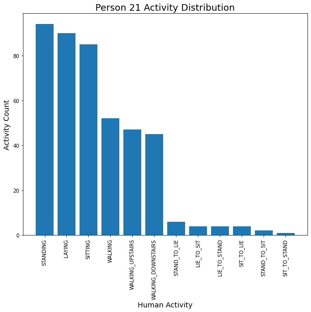
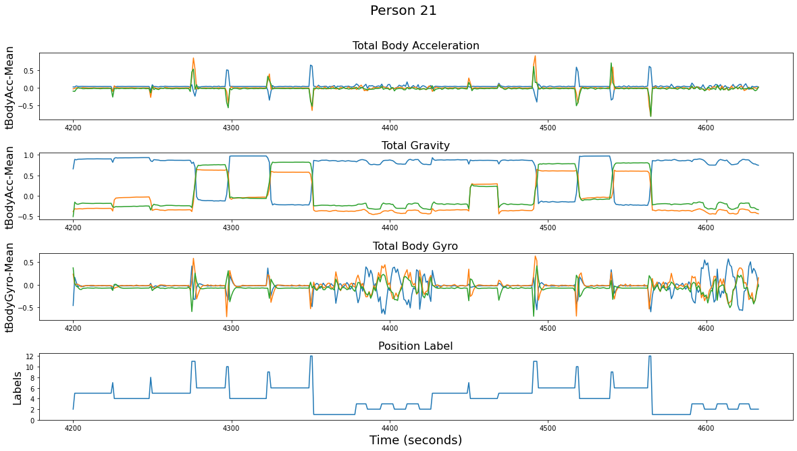
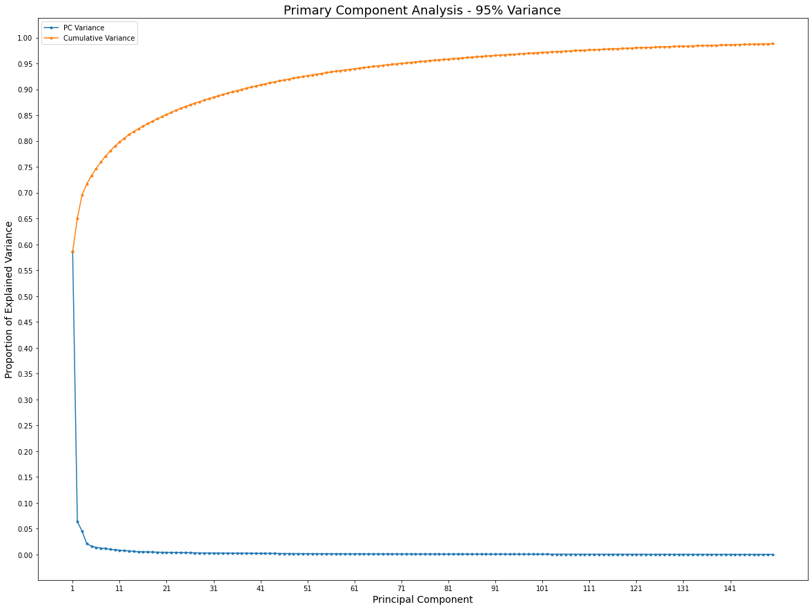

# Smartphone Activity Recognition
Human Activity Recognition (HAR) is a classification problem of predicting human activities and postural transitions based on smartphone accelerometer and gyroscope data.  This project uses classification and ensemble algorithms to predict human activities from a preprocessed dataset. The dataset is from [UCI](https://archive.ics.uci.edu/ml/datasets/Smartphone-Based+Recognition+of+Human+Activities+and+Postural+Transitions)

## Table of contents
* [General info](#general-info)
* [Screenshots](#screenshots)
* [Technologies](#technologies)
* [Setup](#setup)
* [Features](#features)
* [To-do list:](#to-do-list:)
* [Status](#status)
* [Inspiration](#inspiration)
* [Contact](#contact)

## General info
The goal of this project is to classify the static postures and dynamic activities of people performing basic activities using smartphone accelerometer and gyroscope data.  The twelve activities were as follows:
* 1 WALKING
* 2 WALKING_UPSTAIRS
* 3 WALKING_DOWNSTAIRS
* 4 SITTING
* 5 STANDING
* 6 LAYING
* 7 STAND_TO_SIT
* 8 SIT_TO_STAND
* 9 SIT_TO_LIE
* 10 LIE_TO_SIT
* 11 STAND_TO_LIE
* 12 LIE_TO_STAND 

The movement data was recorded with a Samsung Galaxy S2.  The movement data consisted of x, y, and z measurements for the accelerometer data (linear acceleration) and the gyroscopic data (angular velocity) from the smart phone. Observations were recorded at 50 Hz (i.e. 50 data points per second). Each of the 30 subjects performed the sequence of activities twice, once with the device on their left-hand-side and once with the device on their right-hand side.

The data was preprocessed for noise and split into time windows.  Then feature engineering was applied to the time windows and the whole dataset was split into train and test sets.  The pre-processing steps included:

* Pre-processing accelerometer and gyroscope using noise filters
* Splitting data into fixed windows of 2.56 seconds (128 data points) with 50% overlap
* Splitting of accelerometer data into gravitational (total) and body motion components
* Feature engineering of time and frequency measurements used in human activity recognition making a feature matrix of 561 features
* Dataset was split 70%/30% train data and test data

Experiment results with a support vector machine intended for use on a smartphone resulted in a predictive accuracy of 89% on the test dataset.

## Screenshots

## Technologies
* Python 3.9.0 as development language
* Sci-Kit Learn 0.23.2 for modeling
* Models - KNearestNeighbors Classifier, RandomForestClassifier, XGBoostClassifier

## Setup
Setup environment by importing pandas, numpy, seaborn and the sci-kit learn models mentioned in the Technologies section

## Code Examples
See project notebooks

## Features
Dataset consists of 10,929 rows by 561 columns, split (70/30) into training and testing datasets

## To-do list:
* data cleaning (target vector names)
* exploratory data analysis
* dimensionality reduction & feature selection
* determine best classification algorithm
* tune model hyperparameters
* make presentation to include background information about your project, information about your data, visualizations, modeling techniques, and results/conclusions/recommendations.

## Status
Project is: _complete_

## Inspiration
As always, the good people in my coding community who provide guidance and wisdom as I take on more projects to develop my skillset.  Also, I want to see how easy it is to make a prediction of posture based on data from cell phones. Lots of help came from [Jason Brownlee](https://machinelearningmastery.com/how-to-model-human-activity-from-smartphone-data/) at machinelearningmastery.com

## Contact
Created by Kenny Bundy - feel free to contact me!